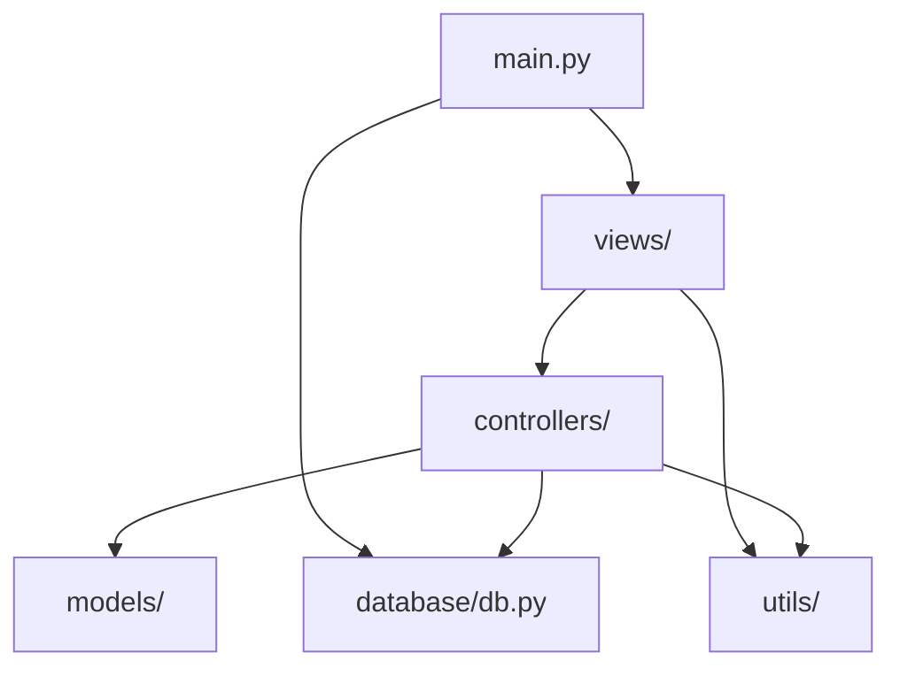

# Architecture Documentation

This document describes the architectural design of the POS System.

## Overview

The application follows a variation of the **Model-View-Controller (MVC)** pattern, tailored for a desktop environment using PyQt5.

## Components

### 1. View Layer (`views/`)
Responsible for the user interface. It consists of PyQt5 widgets that display data and capture user input.
- **Main Window**: The container for navigation and switching between different views.
- **Sub-views**: Specialized widgets for Products, Sales, Customers, etc.
- **Styling**: Uses `styles.qss` for CSS-like styling of UI elements.

### 2. Controller Layer (`controllers/`)
Acts as the intermediary between the View and the Data layer.
- Contains the business logic (e.g., calculating totals, validating stock).
- Calls database methods to persist and retrieve information.
- Returns Models to the views for display.

### 3. Model Layer (`models/`)
Simple Python classes (or Data Classes) that represent the entities in the system:
- `Product`
- `Sale`
- `Customer`
- `Supplier`

### 4. Database Layer (`database/`)
Manages persistence using SQLite.
- `db.py` handles connection pooling and schema initialization.
- SQLite is local to the application (`pos.db`).

### 5. Utility Layer (`utils/`)
Reusable helper modules:
- `lang.py`: Internationalization (i18n).
- `barcode.py`: Logic for generating and parsing barcodes.
- `receipt.py`: Logic for formatting and saving transaction receipts.
- `icons.py`: Abstraction for icon sets (QtAwesome).

## Data Flow

1. **User Action**: User clicks a button in a `View`.
2. **Controller Call**: The `View` calls a method on the corresponding `Controller`.
3. **Business Logic**: The `Controller` performs logic and interacts with the `Database`.
4. **Data Retrieval**: The `Controller` receives data from the `Database` and wraps it in `Models`.
5. **UI Update**: The `Controller` returns these `Models` to the `View`, which updates the display.

## Dependency Graph

